# Procesverslag
**Auteur:** -Nick Ebbelaar-

Markdown cheat cheet: [Hulp bij het schrijven van Markdown](https://github.com/adam-p/markdown-here/wiki/Markdown-Cheatsheet). Nb. de standaardstructuur en de spartaanse opmaak zijn helemaal prima. Het gaat om de inhoud van je procesverslag. Besteedt de tijd voor pracht en praal aan je website.

## Bronnenlijst
1. -bron 1-
2. -bron 2-
3. -...-

## Eindgesprek (week 7/8)

-dit ging goed & dit was lastig-

**Screenshot(s):**

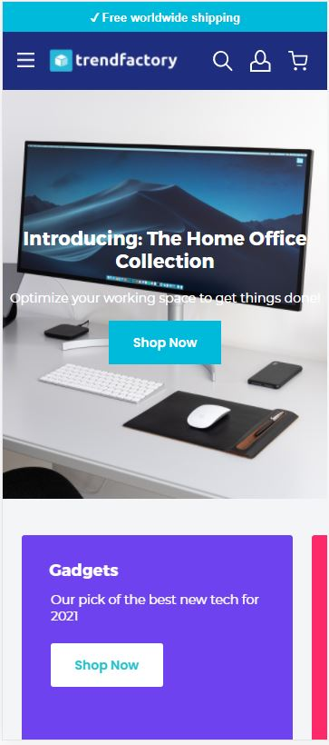

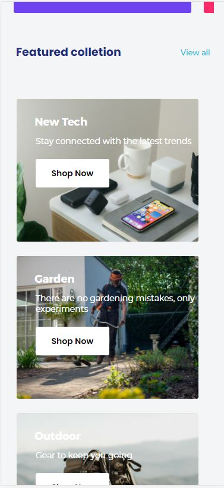

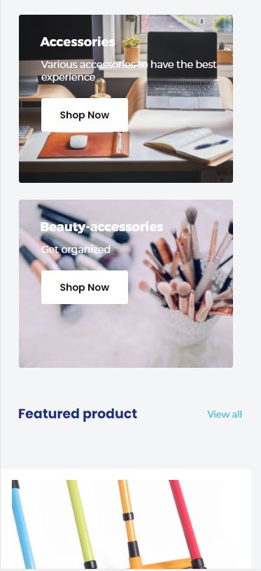

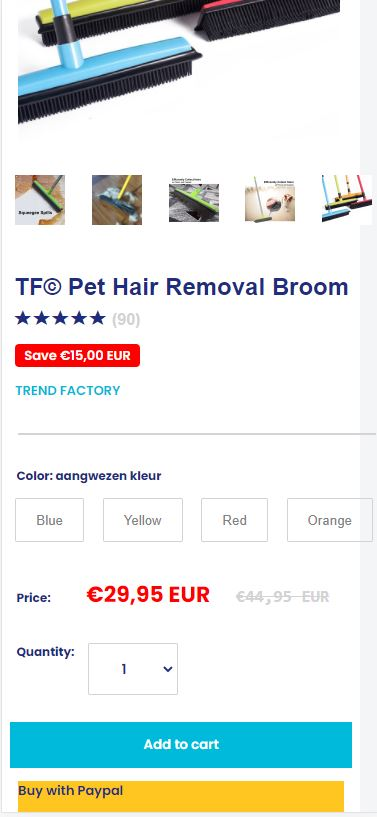

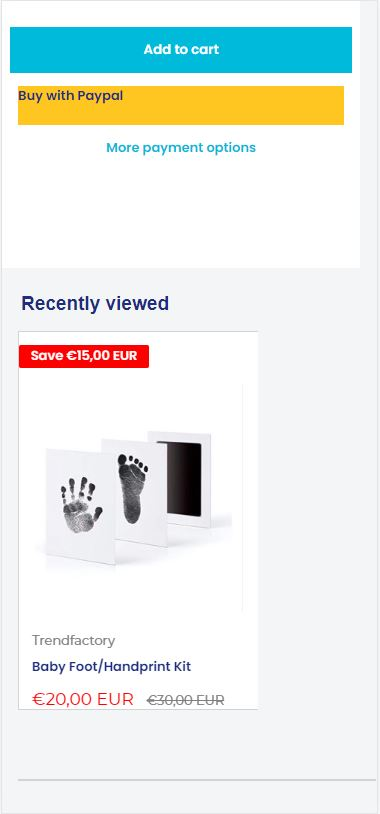

-screenshot(s) van je eindresultaat-

## Voortgang 3 (week 6)
- De screenreader werkt voor wat ik tot nu toe heb gemaakt vrij goed. Alle knoppen worden duidelijk verteld en de tekst wordt ook beschreven als ik met tab overal langs ga -
-same as voortgang 1-

## Voortgang 2 (week 5)

Ik heb de code wat netter gemaakt en tijdens het voortgang gesprek met sanne afgewerkt.

## Voortgang 1 (week 3)

### Stand van zaken

Nu nog maar een klein beetje HTML CSS van het het eerste gedeelte van de website. Ik dacht dat dit heel moeilijk zou zijn maar dit verliep tot nu toe heel soepel.

**Screenshot(s):**

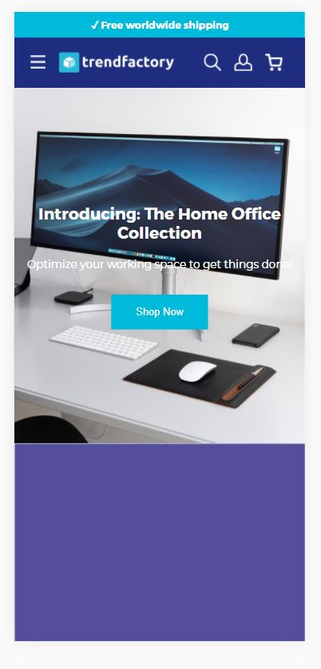

### Agenda voor meeting

-samen met je groepje opstellen-

| Nick     | Redouane         | Wessel    | Ugur        |
| ---            | ---                | ---          | ---              |
| Nav aan de bovekant laten plakken  |Vragen vooraf             | Hoe maak je een slideshow |   |
|Of mijn code semantisch correct| | Meer resultaten laden
|Klik op hamburger mene dat resulteert in een pop up met alle resultaten| ...                | ...          | ...              |

### Verslag van meeting

-na afloop snel uitkomsten vastleggen-

## Breakdownschets (week 1)

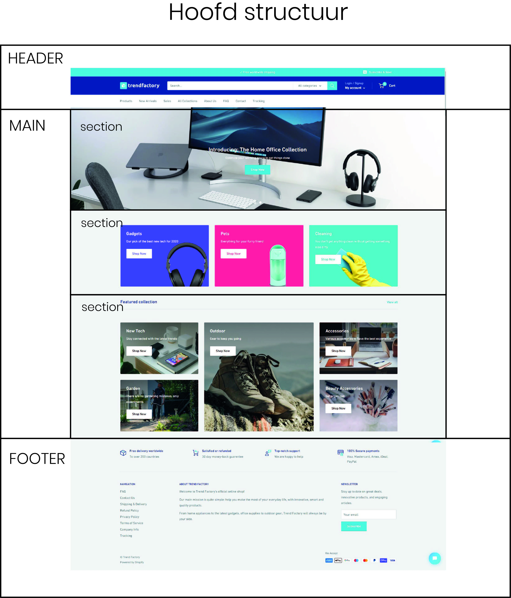
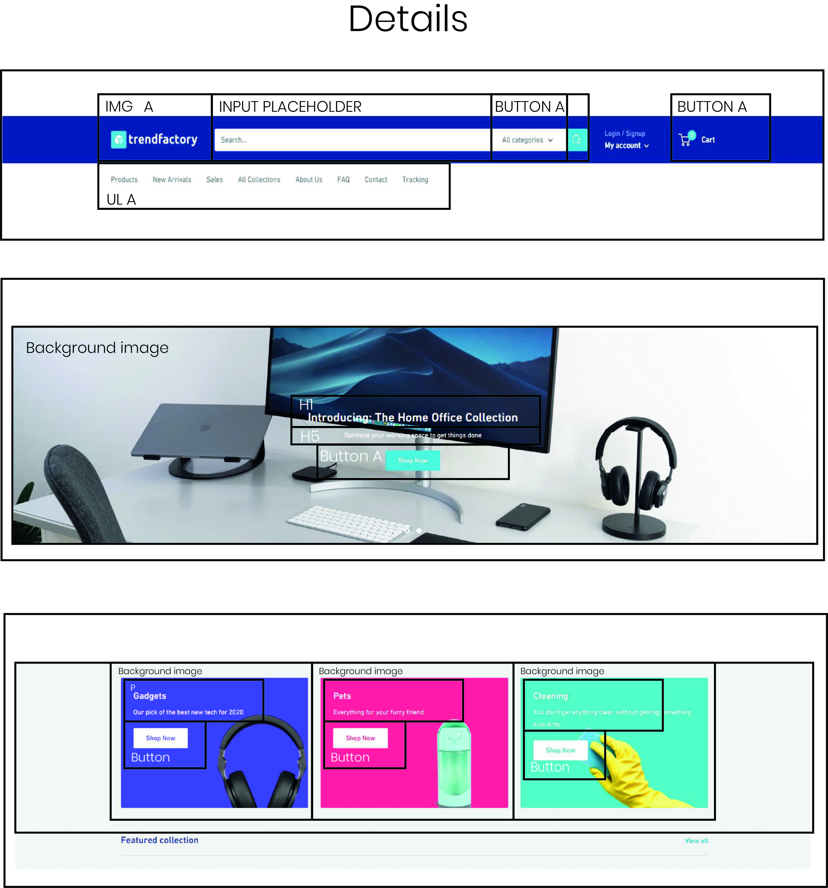
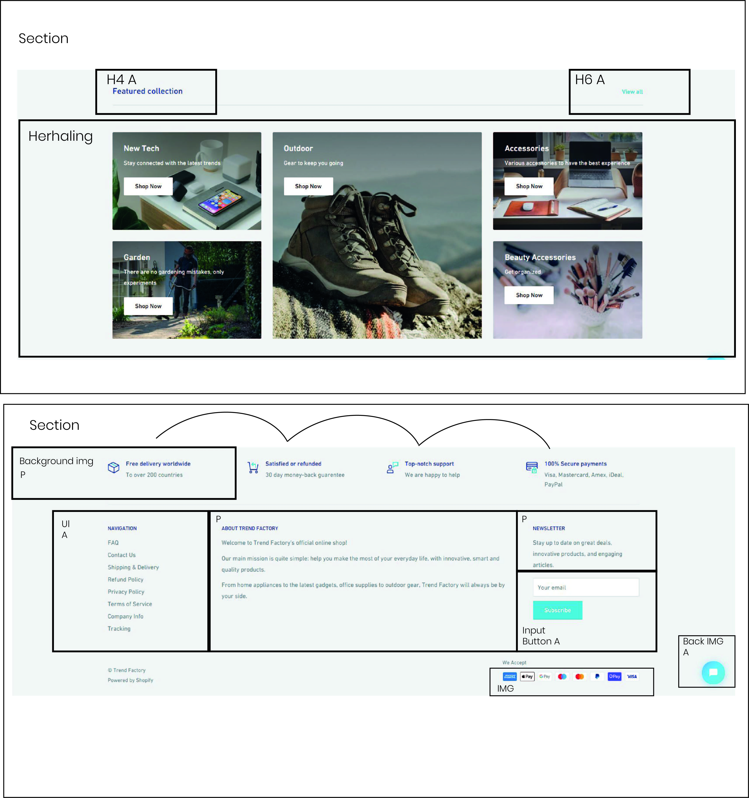

## Intake (week 1)
-uitwerken voor de kick-off werkgroep - begin van de eerste week-

**Je startniveau:** -blauw-

**Je focus:** -surface plane-

**Je opdracht:** https://trendfactory.store/

**Screenshot(s) van de eerste pagina (small screen):**

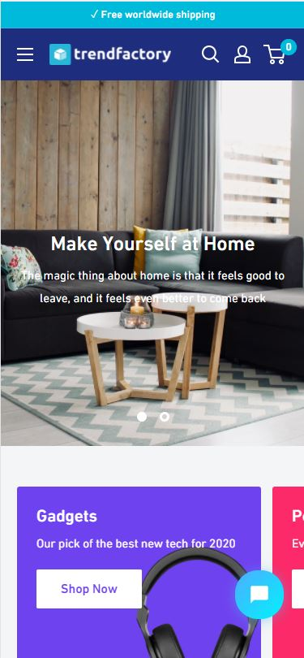

**Screenshot(s) van de tweede pagina (sma4ll screen):**

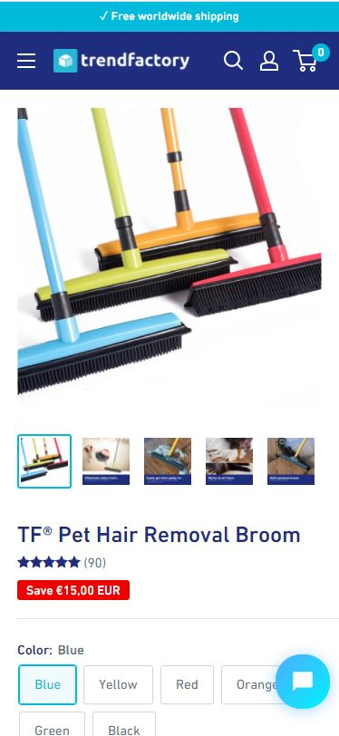
