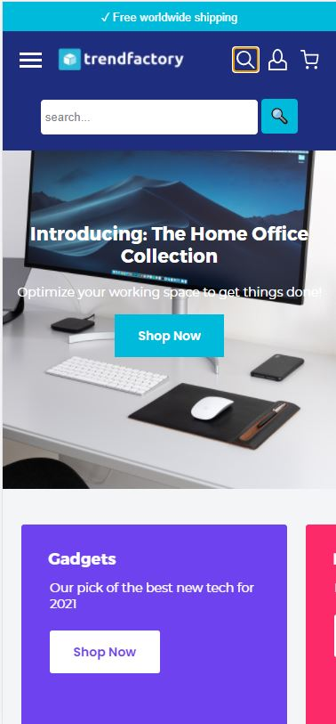

# Eindgesprek Herkansing (week 9)
  Ik heb 2 pagina's van mijn website afgerond en een aantal micro interacties toegevoegd. Ik heb een transitie in het hamburger menu die van vorm veranderd, een pop up menu en een uitschuivende zoekbalk. Ik zou er graag nog meer willen doen maar dat is neit gelukt voor de deadline, in mijn eigen tijd ga ik hier nog wel mee verder omdat ik de opdracht achteraf toch wel leuk vondt. Ik begin altijd vrij stroef met nieuwe onderwerpen binnen html, css en javascript maar als het eenmaal lukt gaat alles vrij soepel door. Hieronder zijn nog wat screensshots van de website te zien. Ik ben in totaal best lang bezig geweest met het gehele process omdat ik veel dingen opnieuw moest uitvinden maar dit was wel weer een goede opfrisser voor mijn kennis over html, css en JavaScript.

  **Screenshot(s):**
  
  
  

  

  

  

  

# Eindgesprek (week 7/8)

Het wegwerken van alle ID's en Divs die ik in het begin had gebruikt was vrij lastig, het kosten namelijk aardig wat tijd. Ook had ik moeite met de overflow-x, het zou heel simpel moeten zijn maar toch mislukte er steeds iets. Dit is ook niet gelukt uiteindelijk, dit is de zien bij de 'RECENTLY VIEWED.'

Mijn site is zeker nog niet af en er moeten nog aardig wat dingen worden toegevoegd, zo ook de javascript.

Dit wil ik graag in de herkansing helemaal afhebben.

Voor nu zou ik graag wat vragen willen stellen over de foute die er nu in de code zitten zodat ik dit kan oplossen en feedback kan krijgen op mijn code.

**Screenshot(s):**

## Voortgang 3 (week 6)
 De screenreader van de officele website is naar mijn idee helemaal compleet, ik kon namelijk geen onduidelijkheden vinden. Problemen verhelpen heb ik dan ook niet kunnen doen. Bij mijn eigen website vondt ik het ook goed werken, het was namelijk te volgen. Vervelend was wel dat hij soms onnodige informatie bij een element afspeelden en na de volgende klik pas de juiste informatie waardoor je twee keer moest klikken. Buiten dat verteld de screenreader wel alle informatie en zou je het dus blind de website kunnen bezoeken.

## Voortgang 2 (week 5)

Ik heb de code wat netter gemaakt en tijdens het voortgang gesprek met sanne afgewerkt.

## Voortgang 1 (week 3)

### Stand van zaken

Nu nog maar een klein beetje HTML CSS van het het eerste gedeelte van de website. Ik dacht dat dit heel moeilijk zou zijn maar dit verliep tot nu toe heel soepel.

**Screenshot(s):**

### Agenda voor meeting

-samen met je groepje opstellen-

| Nick     | Redouane         | Wessel    | Ugur        |
| ---            | ---                | ---          | ---              |
| Nav aan de bovekant laten plakken  |Vragen vooraf             | Hoe maak je een slideshow |   |
|Of mijn code semantisch correct| | Meer resultaten laden
|Klik op hamburger mene dat resulteert in een pop up met alle resultaten| ...                | ...          | ...              |

### Verslag van meeting

-na afloop snel uitkomsten vastleggen-

## Breakdownschets (week 1)

## Intake (week 1)
-uitwerken voor de kick-off werkgroep - begin van de eerste week-

**Je startniveau:** -blauw-

**Je focus:** -surface plane-

**Je opdracht:** https://trendfactory.store/

**Screenshot(s) van de eerste pagina (small screen):**

**Screenshot(s) van de tweede pagina (sma4ll screen):**

